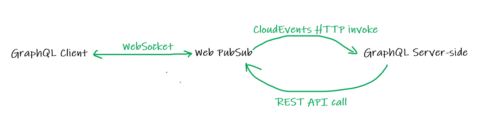
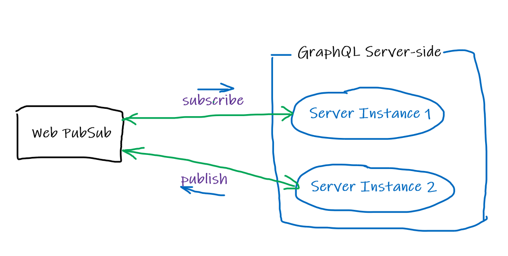
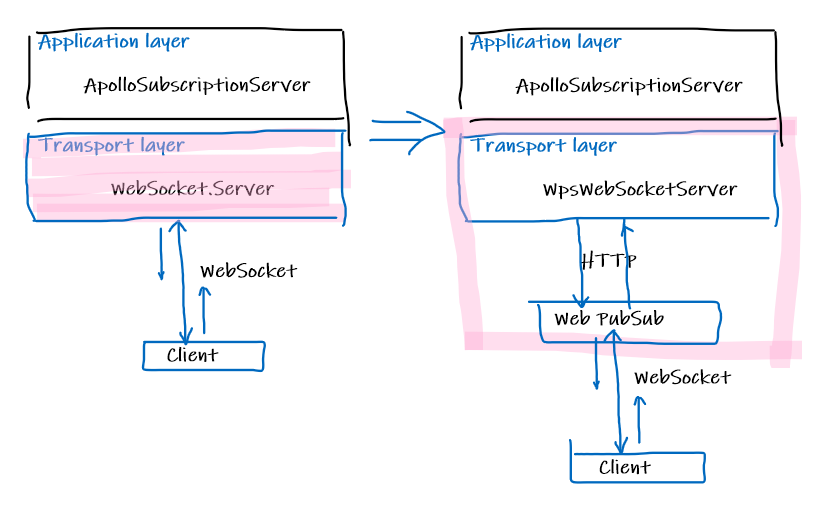

# Implement GraphQL Subscription using Web PubSub

Clients connect to the server using WebSocket connections when using GraphQL Subscriptions. 

Web PubSub can help maintianing the WebSocket connections so that the app servers can get rid of such work and easily scale.

In this article, we use Apollo.JS as the GraphQL library and let's walk through how we leverage Web PubSub in Apollo.js to help handle WebSocket connections.

Web PubSub can act as two roles when used in GraphQL Subscription:
1. Help maintain the client WebSocket persistent connections
    

2. Acts as the backend Pub/Sub engine
    

First let's setup the Apollo subscription.
You can see that with all these set, the client establishes a WebSocket connection with the Apollo server.

What if Apollo server needs to upgrade, what if we scale to use multiple instances for more concurrent clients.

WebPubSub can not only helps to maintain the WebSocket connections, but also acts as a backend Pub/Sub engine communicating between the multiple Apollo server instances.

Let's update the Apollo server to use Web PubSub.

First let's see how to use Web PubSub to maintain the WebSocket connections. First we need to tell the client that `subscriptionPath` is the path for Web PubSub service:
```js
apolloServer.subscriptionsPath = await wpsServer.getWebSocketUrl();
```

Under the hood, Apollo server uses a `socket` to accept WebSocket connections, when Web PubSub helps to hold the WebSocket connections, there is no need for the app server to manage the WebSocket connections, instead, app server needs to dispatch the incoming traffic from Web PubSub. To achieve this and to keep the minimum code change, we use a `WpsWebSocketServer` class to replace the original transport layer `WebSocket.Server` and help to dispatch the incoming traffic to the Apollo application layer seamlessly. 

`WpsWebSocketServer` implements the methods and properties provided by `WebSocket.Server` in its own way, it dispatches the incoming traffic from Web PubSub to the application layer, and also routes the outbound messages to Web PubSub and then to the clients.



Run the sample:
1. Setup the Event Handlers from the portal
2. Setup local [ngrok]() so that the local app server is exposed and the Web PubSub can find your app server
3. Run the sample and you can use F12 Network to view the incoming and outgoing traffic

You can see that from the client's perspective of view, it establishes a WebSocket connection with the Web PubSub service, all the inbound and outbound traffic go in this persistent connection.

You can see from the [ngrok dashboard]() perspective of view that every message transforms into a CloudEvent based HTTP call to your local app server.


Another usage of the Web PubSub is to use it as the backend Pub/Sub engine when there are multiple server instances running. Web PubSub can also be leveraged to do Pub/Sub between backend servers and it is pretty straight forward that each server establishes a WebSocket connection to the Web PubSub service with `json.webpubsub.azure.v1` subprotocol.